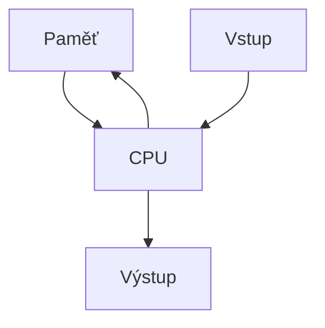
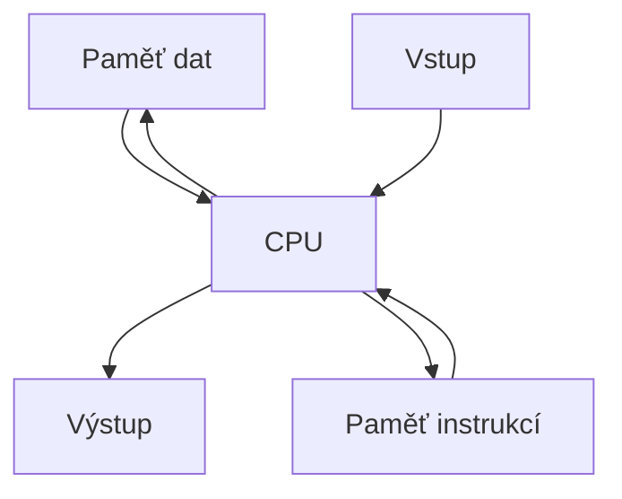
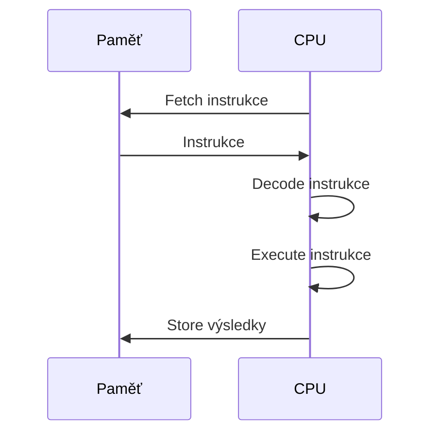
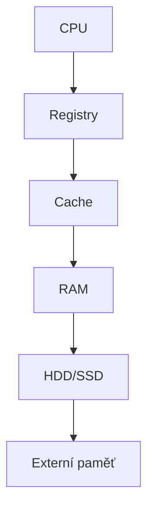

![[Okruhy#^fa5554]]
### Základní architektury počítačů

#### Von Neumannova architektura

Von Neumannova architektura je základem pro většinu moderních počítačů. Je pojmenována po Johnu von Neumannovi, který tuto koncepci navrhl v roce 1945. Tato architektura je založena na myšlence, že počítač by měl mít jednu jednotnou paměť, kde jsou uloženy jak programové instrukce, tak i data.

##### Principy:

1. **Jednotná paměť**:
   - Instrukce a data jsou uloženy ve stejné paměti. To znamená, že CPU čte jak instrukce, tak data ze stejného paměťového prostoru.

2. **Sekvenční vykonávání**:
   - Instrukce jsou vykonávány sekvenčně podle pořadí, ve kterém jsou uloženy v paměti. To zahrnuje cyklus načítání instrukce (fetch), dekódování (decode) a vykonání (execute).

3. **Programovatelný obsah paměti**:
   - Počítač je řízen instrukcemi uloženými v paměti, což umožňuje flexibilní programování.

4. **Centralizovaná ALU a Řadič**:
   - Počítač se skládá z několika klíčových komponent: aritmeticko-logické jednotky (ALU), řadiče, paměti, vstupních a výstupních zařízení.

##### Výhody:

- **Jednodušší konstrukce**: Díky jednotné paměti je konstrukce jednodušší a levnější.
- **Flexibilita**: Umožňuje snadné přeprogramování změnou obsahu paměti.

##### Nevýhody:

- **Omezený paralelismus**: Všechny operace jsou prováděny sekvenčně, což omezuje výkon.
- **Úzké místo ve sběrnici**: Použití jedné sběrnice pro data i instrukce může způsobit úzké hrdlo, když je vyžadováno intenzivní přenos dat.

##### Schéma von Neumannovy architektury:

#### Harvardská architektura

Harvardská architektura byla vyvinuta jako vylepšení von Neumannovy architektury. Hlavní myšlenkou je oddělení paměti pro instrukce a data, což umožňuje paralelní přístup a tím zvyšuje výkon.

##### Principy:

1. **Oddělené paměti**:
   - Instrukce a data jsou uloženy v oddělených paměťových prostorech. To umožňuje CPU přistupovat k instrukcím a datům nezávisle a současně.

2. **Paralelní přístup**:
   - Umožňuje současný přístup k instrukcím a datům, což zvyšuje efektivitu a výkon.

##### Výhody:

- **Vyšší rychlost**: Paralelní přístup k instrukcím a datům zrychluje vykonávání programů.
- **Bezpečnost**: Oddělení paměti zvyšuje bezpečnost, protože instrukce nemohou být náhodně přepsány daty.

##### Nevýhody:

- **Složitější konstrukce**: Oddělené paměti a dvě sběrnice zvyšují složitost a náklady na výrobu.
- **Větší nároky na řízení**: Nutnost řízení dvou sběrnic a dvou paměťových prostorů.

##### Schéma Harvardské architektury:

### Princip fungování počítače

Princip fungování počítače je založen na cyklickém procesu vykonávání instrukcí, které jsou načítány z paměti. Tento proces se skládá z několika kroků:

1. **Načítání instrukcí (Fetch)**:
   - CPU načte instrukci z paměti. Instrukce je umístěna na adrese, kterou ukazuje ukazatel instrukce (Instruction Pointer, IP).

2. **Dekódování instrukcí (Decode)**:
   - Instrukce je dekódována, aby CPU rozuměl, jakou operaci má provést a jaké operandy použít.

3. **Vykonávání instrukcí (Execute)**:
   - CPU vykoná instrukci, což může zahrnovat aritmetické operace, logické operace, přesuny dat nebo změnu adresy v ukazateli instrukce.

4. **Ukládání výsledků (Store)**:
   - Výsledky operací jsou uloženy zpět do paměti nebo registrů.

### Způsoby adresování

Adresování určuje způsob, jakým CPU přistupuje k operandům (datům) při vykonávání instrukcí. Existuje několik způsobů adresování, které mají různé výhody a nevýhody:

1. **Přímé adresování**:
   - Adresa operandu je přímo uvedena v instrukci.
   - Výhoda: Jednoduchost.
   - Nevýhoda: Omezený dosah adresování.

2. **Nepřímé adresování**:
   - Instrukce obsahuje adresu, kde je uložena skutečná adresa operandu.
   - Výhoda: Flexibilita a možnost přístupu k širšímu prostoru paměti.
   - Nevýhoda: Vyšší složitost a více paměťových přístupů.

3. **Indexované adresování**:
   - Adresa operandu je určena kombinací základní adresy a hodnoty indexového registru.
   - Výhoda: Efektivní pro práci s poli a datovými strukturami.
   - Nevýhoda: Může být složitější na implementaci.

4. **Registrární adresování**:
   - Operand je uložen v registru, jehož adresa je uvedena v instrukci.
   - Výhoda: Velmi rychlý přístup k operandům.
   - Nevýhoda: Omezený počet registrů.

### Hierarchické uspořádání pamětí

Paměťový systém počítače je organizován hierarchicky podle rychlosti a kapacity pamětí. Tato hierarchie umožňuje optimalizovat výkon a efektivitu práce s daty.

1. **Registry**:
   - Nejrychlejší a nejmenší paměť, umístěná přímo v CPU.
   - Používají se pro dočasné uložení dat a instrukcí během zpracování.

2. **Cache**:
   - Rychlá, ale menší paměť mezi CPU a hlavní pamětí.
   - Slouží ke zrychlení přístupu k často používaným datům.

3. **Hlavní paměť (RAM)**:
   - Poměrně rychlá a středně velká paměť, kde jsou uloženy běžící programy a data.
   - Poskytuje přístup k datům pro aktuálně vykonávané procesy.

4. **Sekundární paměť (HDD, SSD)**:
   - Pomalejší, ale velmi velká paměť pro dlouhodobé ukládání dat.
   - Používá se pro trvalé ukládání programů a dat.

5. **Externí paměť (Optické disky, USB)**:
   - Výměnná a často pomalejší paměť pro zálohování a přenos dat.
   - Používá se pro ukládání dat mimo hlavní systém.

Tímto způsobem je zajištěno, že data jsou vždy dostupná co nejrychleji podle jejich aktuální potřeby a frekvence používání.