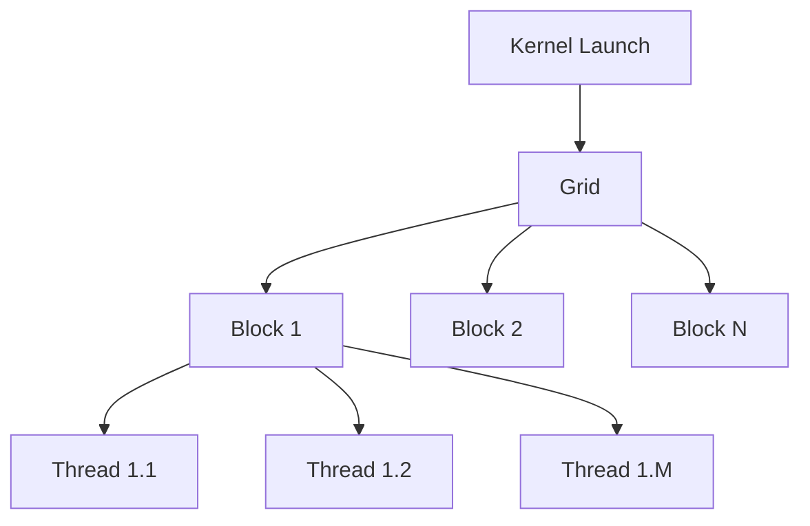
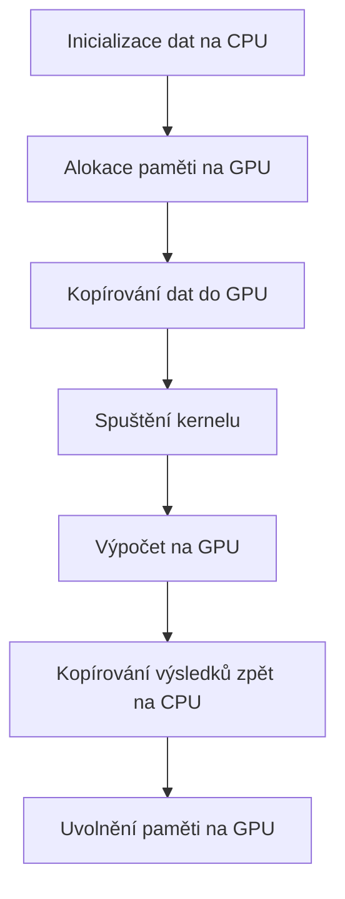

![[Okruhy#^0b33c9]]

### GPU a CUDA

#### Důvody využívání GPU

Grafické procesory (GPU) jsou speciálně navrženy pro rychlé a efektivní zpracování paralelních úloh, což je v kontrastu s CPU, které jsou optimalizovány pro sekvenční zpracování úloh. Důvody pro využívání GPU zahrnují:

1. **Paralelní architektura**: GPU mají mnoho jader, která mohou zpracovávat tisíce vláken současně. To umožňuje velmi vysokou úroveň paralelního zpracování, což je ideální pro úlohy jako grafické renderování, vědecké výpočty a strojové učení.

2. **Výkon**: Pro určité typy úloh (např. maticové operace, transformace obrazu) mohou GPU dosáhnout mnohem vyššího výkonu než CPU díky své schopnosti paralelního zpracování.

3. **Energetická efektivita**: GPU mohou být energeticky efektivnější pro masivně paralelní výpočty, protože dokážou zpracovávat více operací na watt ve srovnání s CPU.

4. **Flexibilita**: Moderní GPU jsou programovatelné a lze je využít nejen pro grafiku, ale také pro obecné výpočty (GPGPU - General-Purpose computing on Graphics Processing Units).

#### Popis technologie CUDA

CUDA (Compute Unified Device Architecture) je platforma a programovací model vytvořený společností NVIDIA, který umožňuje programátorům využívat sílu GPU pro obecné výpočty.

##### Základní koncepty CUDA:

1. **Kernels**: Funkce napsané v jazyce CUDA C/C++, které běží na GPU. Každý kernel je spuštěn paralelně v mnoha vláknech.

2. **Bloky a mřížky (Grids)**: Vlákna jsou organizována do bloků a bloky jsou organizovány do mřížky. To umožňuje škálování výpočtů na GPU.

3. **Paměťový model**: CUDA rozlišuje několik typů paměti, které jsou optimalizovány pro různé účely (globální, sdílená, konstanta, textur).

4. **Hierarchie paralelismu**: CUDA podporuje hierarchii paralelismu, kde bloky a vlákna mohou být spravovány a synchronizovány nezávisle.

##### Schéma CUDA:

#### Postup výpočtu v CUDA

1. **Inicializace dat na CPU**: Připravte data na CPU, která mají být zpracována GPU.
2. **Přenos dat do GPU paměti**: Použijte CUDA API funkce pro kopírování dat z CPU paměti do GPU globální paměti.
3. **Kernel Launch**: Spusťte CUDA kernel, který bude provádět výpočty na GPU.
4. **Výpočet na GPU**: Kernel běží paralelně na mnoha vláknech GPU, provádějící zadané operace.
5. **Přenos výsledků zpět na CPU**: Po dokončení výpočtu přeneste výsledky zpět z GPU paměti do CPU paměti.
6. **Uvolnění paměti**: Uvolněte alokovanou paměť na GPU.

#### Základní pravidla programování v CUDA

1. **Maximalizace paralelismu**: Rozdělte úlohu tak, aby byla maximálně paralelizovatelná. Používejte velké množství bloků a vláken.
2. **Efektivní správa paměti**: Využívejte sdílenou paměť pro snížení přístupu k pomalejší globální paměti. Minimalizujte přenosy dat mezi CPU a GPU.
3. **Minimalizace synchronizace**: Používejte synchronizaci vláken uvnitř bloků opatrně, protože může snižovat výkon.
4. **Optimalizace přístupu k paměti**: Zajistěte koalescentní přístup k paměti, aby se minimalizovaly penalizace za přístup k paměti.

#### Práce s pamětí v CUDA

CUDA rozlišuje několik typů paměti, které mají různé vlastnosti a účely:

1. **Globální paměť**:
   - Velká, ale pomalá paměť. Přístupná všem vláknům.
   - Využívá se pro data, která potřebují být přístupná během celé životnosti kernelu.

2. **Sdílená paměť**:
   - Rychlá paměť přístupná všem vláknům v jednom bloku.
   - Používá se pro mezivýpočty a často přistupovaná data.

3. **Registre**:
   - Nejrychlejší paměť, ale omezená velikostí.
   - Používá se pro ukládání lokálních proměnných vláken.

4. **Konstantní paměť**:
   - Optimalizována pro rychlý přístup k datům, která se nemění.
   - Přístupná všem vláknům, ale jen ke čtení.

5. **Texturová paměť**:
   - Optimalizována pro specifické přístupy k datům, často využívána při práci s obrazovými daty.

#### Postup výpočtu v CUDA

1. **Alokace paměti na GPU**:
   - Použijte `cudaMalloc()` pro alokaci globální paměti na GPU.

2. **Kopírování dat z CPU do GPU**:
   - Použijte `cudaMemcpy()` pro kopírování dat z hostitelské (CPU) paměti do zařízení (GPU) paměti.

3. **Spuštění kernelu**:
   - Definujte a spusťte kernel, který bude vykonávat paralelní výpočty na GPU.

4. **Synchronizace vláken**:
   - Použijte `__syncthreads()` pro synchronizaci vláken uvnitř bloku.

5. **Kopírování výsledků zpět na CPU**:
   - Použijte `cudaMemcpy()` pro kopírování výsledků z GPU paměti zpět do CPU paměti.

6. **Uvolnění paměti na GPU**:
   - Použijte `cudaFree()` pro uvolnění paměti alokované na GPU.

Tímto způsobem je možné využít plný potenciál GPU pro akceleraci výpočtů pomocí technologie CUDA.