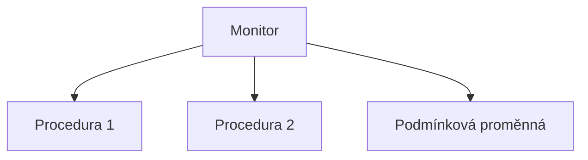
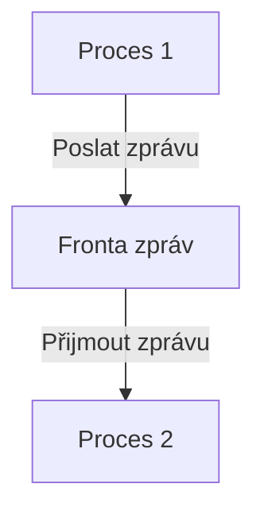
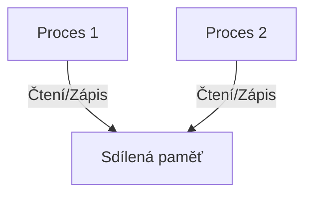

![[Okruhy#^19fd67]]

#### Souběh a kritická sekce

**Souběh** označuje situaci, kdy dva nebo více procesů běží současně a potenciálně sdílí zdroje. Souběžné vykonávání může vést k problémům, pokud nejsou správně řízeny přístupy k těmto zdrojům.

**Kritická sekce** je část kódu, která přistupuje ke sdílenému zdroji (např. proměnné, souboru), který nemůže být současně používán více než jedním procesem. Pokud více procesů vstoupí do kritické sekce současně, může dojít k nekonzistentnímu stavu nebo chybám.

#### Vzájemné vyloučení

**Vzájemné vyloučení (Mutual Exclusion)** je princip, který zajišťuje, že pouze jeden proces může být v kritické sekci v daném okamžiku. To zabrání konfliktům při přístupu ke sdíleným zdrojům.

#### Základní způsoby realizace vzájemného vyloučení

1. **Vypnutí přerušení**:
   - Proces, který vstoupí do kritické sekce, vypne přerušení, aby zabránil jiným procesům ve vstupu.
   - Nevýhoda: Toto řešení není vhodné pro víceprocesorové systémy a může vést k problémům, pokud proces zapomene přerušení znovu povolit.

2. **Zámky (Locks)**:
   - Jednoduchý zámek umožňuje pouze jednomu procesu vstoupit do kritické sekce.
   - Použití zámků může vést k problémům, jako je zablokování (deadlock) nebo uvěznění (starvation).

3. **Dekkerův algoritmus a Petersonův algoritmus**:
   - Tyto algoritmy poskytují řešení vzájemného vyloučení pro dva procesy bez potřeby speciálního hardware.
   - Nevýhoda: Složitost a omezené použití pro více než dva procesy.

#### Semafor

Semafor je synchronizační nástroj používaný k řízení přístupu ke sdíleným zdrojům. Existují dva základní typy semaforů:

1. **Binární semafor**: Může nabývat pouze dvou hodnot (0 a 1), což je ekvivalentní jednoduchému zámku.
2. **Počítací semafor**: Udržuje počet dostupných zdrojů a umožňuje více procesům současný přístup, dokud není dosaženo limitu.

Operace na semaforech:
- **P (wait)**: Decrementuje hodnotu semaforu. Pokud je hodnota semaforu nula, proces čeká.
- **V (signal)**: Incrementuje hodnotu semaforu a pokud jsou procesy čekající na semafor, jeden z nich je probuzen.

```mermaid
graph TD
    A[Proces 1] -->|P(s)| B[Semafor]
    B -->|V(s)| C[Proces 2]
```

#### Monitor

Monitor je vysokoúrovňový synchronizační nástroj, který kombinuje vzájemné vyloučení a čekací fronty. Monitor je abstraktní datový typ, který obsahuje:

1. **Sdílené proměnné**: Přístupné pouze přes monitorové procedury.
2. **Procedury**: Používají se k přístupu ke sdíleným proměnným.
3. **Podmínkové proměnné**: Používají se k čekání a signalizaci mezi procesy.

Monitor zajišťuje, že pouze jeden proces může vykonávat proceduru monitoru v daném okamžiku.



#### Fronta zpráv

Fronta zpráv je metoda meziprocesní komunikace, kde procesy komunikují výměnou zpráv. Existují dva hlavní typy front zpráv:

1. **Blokující zasílání a přijímání**: Proces, který posílá zprávu, čeká, dokud není zpráva přijata, a proces, který přijímá zprávu, čeká, dokud není zpráva k dispozici.
2. **Neblokující zasílání a přijímání**: Proces může pokračovat, aniž by čekal na doručení nebo přijetí zprávy.



#### Sdílená paměť

Sdílená paměť umožňuje více procesům přístup ke stejnému paměťovému prostoru. Procesy mohou číst a zapisovat data do sdílené paměti. Synchronizace je nezbytná pro zajištění konzistence dat.

1. **Vytvoření sdílené paměti**: Používá se systémové volání (např. `shmget` v Unixu).
2. **Připojení ke sdílené paměti**: Procesy připojují sdílenou paměť do svého adresního prostoru (např. `shmat` v Unixu).
3. **Synchronizace**: Používají se semafory nebo jiné synchronizační nástroje k řízení přístupu.



### Shrnutí

Meziprocesní komunikace je klíčová pro správnou funkci multitaskingových operačních systémů. Správná implementace kritických sekcí a vzájemného vyloučení pomocí nástrojů, jako jsou semafory, monitory, fronty zpráv a sdílená paměť, je nezbytná pro zajištění konzistence a synchronizace mezi procesy.