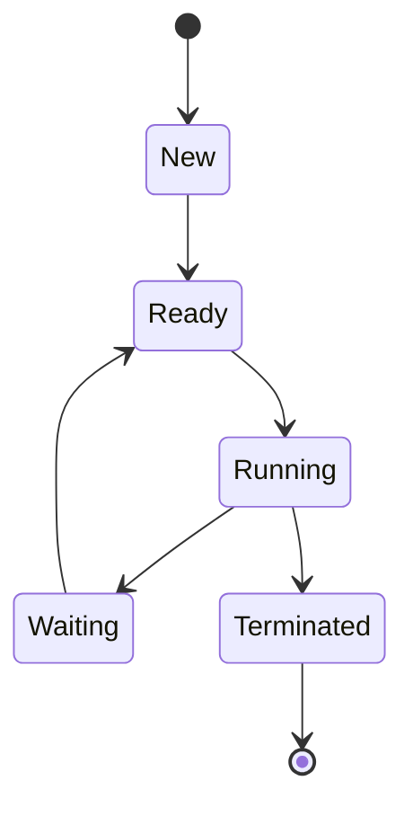
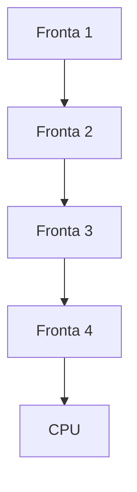

![[Okruhy#^00091d]]

#### Vytváření procesů

Proces je základní jednotka, kterou operační systém používá pro řízení vykonávání programů. Proces zahrnuje kód programu, data, a stavy vykonávání.

1. **Vytvoření procesu**: Proces může být vytvořen několika způsoby, včetně:
   - **Systémovým voláním**: Například v Unixových systémech se procesy vytvářejí pomocí volání `fork()`, které vytvoří nový proces, nebo `exec()`, které nahradí obsah procesu novým programem.
   - **Inicializací systému**: Když je operační systém spuštěn, vytváří se několik základních procesů.
   - **Uživatelskými aplikacemi**: Některé aplikace mohou vytvářet nové procesy za běhu.

#### Implementace procesů v OS

Operační systém implementuje procesy a spravuje jejich vykonávání. Každý proces má svůj vlastní adresní prostor a soubor systémových prostředků. Klíčové komponenty implementace procesů zahrnují:

1. **Adresní prostor**: Každý proces má svůj vlastní virtuální adresní prostor, který zahrnuje kód, data, a zásobník.
2. **Tabulka procesů**: Operační systém udržuje tabulku procesů (process table), která obsahuje informace o všech aktuálně běžících procesech.
3. **Procesní kontext**: Obsahuje informace o stavu procesoru a dalších hardwarových registrů, které jsou nutné k návratu do vykonávání procesu.

#### Tabulka procesů

Tabulka procesů je datová struktura, kterou operační systém používá k uchování informací o všech procesech. Každý záznam v tabulce procesů obsahuje:

1. **Identifikátor procesu (PID)**: Unikátní číslo identifikující proces.
2. **Stav procesu**: Aktuální stav procesu (běží, čeká, spí, atd.).
3. **Programový čítač**: Ukazuje na následující instrukci, kterou má proces vykonat.
4. **Ukazatele na paměťové oblasti**: Informace o paměťových oblastech, které proces používá.
5. **Informace o plánování**: Priorita procesu a další informace používané plánovacím algoritmem.
6. **Informace o otevřených souborech**: Seznam souborů, které má proces otevřené.

#### Stavy procesů

Proces může během svého životního cyklu přecházet mezi několika stavy:

1. **Nový (New)**: Proces je vytvořen, ale ještě nezačal běžet.
2. **Běžící (Running)**: Proces je právě vykonáván procesorem.
3. **Čekající (Waiting)**: Proces čeká na událost (např. dokončení I/O operace).
4. **Připravený (Ready)**: Proces je připraven běžet, jakmile dostane přidělený procesor.
5. **Ukončený (Terminated)**: Proces dokončil své vykonávání.

#### Obsluha HW přerušení

Hardware přerušení jsou události generované hardwarem, které signalizují, že nějaká akce vyžaduje pozornost procesoru.

1. **Generování přerušení**: Zařízení (např. klávesnice, disk) generuje přerušení, když je připraveno na interakci s procesorem.
2. **Obsluha přerušení**: Procesor zastaví aktuální činnost, uloží svůj stav a zavolá obslužnou rutinu přerušení (Interrupt Service Routine, ISR).
3. **Návrat k normální činnosti**: Po dokončení obsluhy přerušení procesor obnoví svůj předchozí stav a pokračuje v činnosti.

#### Multitasking

Multitasking umožňuje vykonávání více procesů současně. Existují dva hlavní typy multitaskingu:

1. **Kooperativní multitasking**: Procesy dobrovolně předávají kontrolu zpět operačnímu systému.
2. **Preemptivní multitasking**: Operační systém může násilně přerušit proces a přidělit čas jinému procesu.

#### Pseudoparalelismus

Pseudoparalelismus je iluze současného vykonávání více procesů, i když skutečně běží jen jeden proces v jednom okamžiku. Toho je dosaženo rychlým přepínáním mezi procesy.

#### Plánovací algoritmy

Plánovací algoritmy rozhodují, který proces bude přidělen procesoru. Některé běžné plánovací algoritmy zahrnují:

1. **First-Come, First-Served (FCFS)**: Procesy jsou obsluhovány v pořadí, v jakém přicházejí.
2. **Shortest Job Next (SJN)**: Proces s nejkratší dobou vykonávání je obsloužen jako první.
3. **Priority Scheduling**: Procesy jsou obsluhovány podle své priority.
4. **Round Robin (RR)**: Každý proces dostane přidělený časový kvant, po jehož uplynutí je přepnut na další proces.
5. **Multilevel Queue Scheduling**: Procesy jsou zařazeny do různých front podle jejich priority a typu, každá fronta může mít svůj vlastní plánovací algoritmus.
6. **Multilevel Feedback Queue Scheduling**: Dynamická verze multilevel queue scheduling, kde procesy mohou měnit fronty na základě jejich chování a stáří.

Tímto způsobem operační systém zajišťuje efektivní využití procesoru a spravedlivé vykonávání procesů.