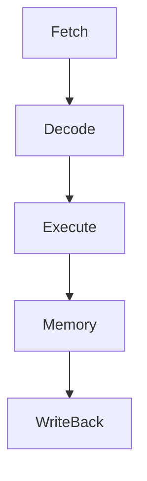
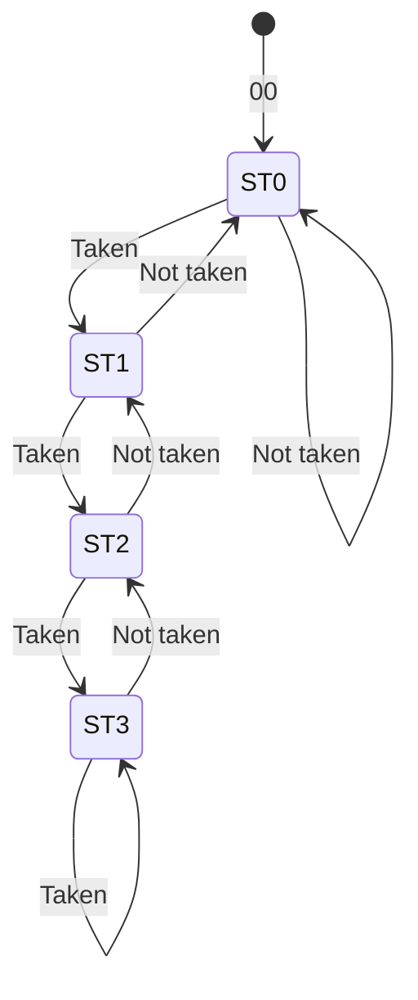

![[Okruhy#^027f95]]
#### Základní konstrukční vlastnosti

RISC (Reduced Instruction Set Computer) procesory jsou navrženy s cílem maximalizovat výkon a efektivitu zpracování pomocí několika klíčových principů:

1. **Redukovaný soubor instrukcí**:
   - RISC procesory používají menší a jednodušší soubor instrukcí, které jsou vykonávány velmi rychle. Každá instrukce je navržena tak, aby mohla být dokončena během jednoho cyklu procesoru.

2. **Pevná délka instrukcí**:
   - Instrukce mají pevnou délku, což zjednodušuje dekódování a zvyšuje rychlost zpracování.

3. **Load/Store architektura**:
   - Data jsou do registrů načítána a ukládána z paměti pouze pomocí specifických instrukcí (LOAD a STORE). Všechny ostatní instrukce pracují přímo s daty v registrech.

4. **Velký počet registrů**:
   - RISC procesory mají obvykle více registrů než CISC (Complex Instruction Set Computer) procesory, což minimalizuje potřebu přístupu k pomalejší hlavní paměti.

5. **Jednoduché způsoby adresování**:
   - Použití několika jednoduchých způsobů adresování zvyšuje rychlost zpracování instrukcí.

6. **Zřetězené zpracování instrukcí (Pipelining)**:
   - Instrukce jsou zpracovávány ve více fázích (např. načítání, dekódování, vykonání), což umožňuje, aby více instrukcí bylo vykonáváno současně.

#### Způsoby urychlování práce procesorů

1. **Pipelining**:
   - Jedná se o techniku, která umožňuje překrytí vykonávání více instrukcí. Každá instrukce je rozdělena do několika fází (např. načítání, dekódování, vykonání, ukládání výsledku) a každá fáze je zpracovávána v samostatné části pipeline.

2. **Superpipelining**:
   - Rozšíření pipeliningu, kde jsou fáze pipeliny ještě dále rozděleny, což umožňuje ještě vyšší paralelismus.

3. **Superskalární architektura**:
   - Procesory mohou vykonávat více instrukcí během jednoho cyklu pomocí více pipeline. To zvyšuje paralelismus a celkový výkon.

4. **Out-of-order execution**:
   - Instrukce mohou být vykonávány v jiném pořadí, než byly načteny, pokud jsou data dostupná a závislosti mezi instrukcemi to umožňují. To minimalizuje čekací doby a zvyšuje využití procesoru.

5. **Predikce skoků**:
   - Technika, která se snaží předpovědět výsledek podmíněného skoku ještě před jeho vyhodnocením, což minimalizuje zpoždění způsobené čekáním na rozhodnutí o skoku.

#### Zřetězené zpracování instrukcí (Pipelining)

Pipelining je technika, která rozděluje vykonávání instrukcí do několika fází. Každá fáze je vykonávána v odděleném stupni pipeline, což umožňuje zpracování více instrukcí současně.

##### Fáze pipeliningu:

1. **Fetch (Načítání)**:
   - Načtení instrukce z paměti.

2. **Decode (Dekódování)**:
   - Dekódování instrukce a určení, jaké operace je potřeba vykonat.

3. **Execute (Vykonání)**:
   - Vykonání operace určené instrukcí (např. aritmetická operace).

4. **Memory (Paměť)**:
   - Přístup k paměti, pokud je potřeba (např. pro načtení nebo uložení dat).

5. **Write-back (Zápis zpět)**:
   - Uložení výsledků vykonané instrukce zpět do registru.

Pipelining umožňuje, aby zatímco jedna instrukce je vykonávána, další je dekódována a ještě další je načítána, čímž se zvyšuje efektivita a výkon.

#### Predikce skoků

Predikce skoků je technika, která se snaží minimalizovat zpoždění způsobené podmíněnými skoky v programu. Podmíněné skoky mohou způsobit zpoždění, protože procesor musí čekat na vyhodnocení podmínky, aby věděl, kterou instrukci vykonat dále.

##### Typy predikce skoků:

1. **Statická predikce**:
   - Jednoduchá metoda, kde je předpověď založena na pevném pravidle (např. vždy předpokládat, že skok bude proveden).

2. **Dynamická predikce**:
   - Složitější metoda, která se přizpůsobuje na základě historie vykonávání skoků. Procesor sleduje, zda se skoky obvykle provádějí nebo ne, a podle toho upravuje své předpovědi.

##### Dvoubitová dynamická predikce:

Jedna z běžných technik dynamické predikce používá dvoubitový stavový automat, který zlepšuje přesnost predikce.

- **ST0**: Silně netaken (skok se obvykle neprovádí).
- **ST1**: Slabě netaken.
- **ST2**: Slabě taken (skok se obvykle provádí).
- **ST3**: Silně taken.

Stavy se mění podle výsledků posledních skoků, což umožňuje procesoru lépe předpovídat budoucí skoky na základě předchozího chování.

### Shrnutí

RISC procesory jsou navrženy tak, aby poskytovaly vysoký výkon prostřednictvím jednoduchého a efektivního souboru instrukcí, velkého počtu registrů a technik, jako je pipelining, superskalární architektura a predikce skoků. Tyto procesory jsou optimalizovány pro rychlé vykonávání instrukcí a efektivní využití paměti a zdrojů procesoru.