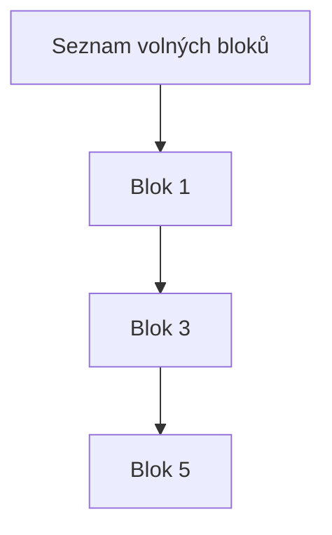

![[Okruhy#^eb409f]]

#### Princip fungování virtuální paměti

Virtuální paměť je technologie, která umožňuje počítači zdánlivě mít více paměti, než je fyzicky dostupná. Tohoto je dosaženo kombinací fyzické paměti (RAM) a úložiště na disku. Virtuální paměť poskytuje následující výhody:

1. **Izolace procesů**: Každý proces má svůj vlastní virtuální adresní prostor, což zajišťuje, že jeden proces nemůže ovlivnit jiný proces.
2. **Efektivní využití paměti**: Virtuální paměť umožňuje, aby se části programů a dat, které nejsou právě používány, mohly přesunout na disk, čímž se uvolní fyzická paměť pro jiné účely.
3. **Jednodušší programování**: Programátoři mohou psát aplikace, jako by měly k dispozici velký, nepřerušovaný blok paměti.

##### Jak funguje virtuální paměť:

1. **Adresování**: Procesor generuje virtuální adresy, které jsou překládány na fyzické adresy pomocí tabulek stránek.
2. **Tabulky stránek**: Tyto tabulky jsou datové struktury, které mapují virtuální adresy na fyzické adresy.
3. **Stránkování**: Paměť je rozdělena na bloky pevné velikosti, zvané stránky (virtuální) a rámce (fyzické). Virtuální stránky jsou mapovány na fyzické rámce.

##### Schéma fungování virtuální paměti:

```mermaid
graph LR
    A[Procesor] -->|Virtuální adresa| B[MMU (Memory Management Unit)]
    B -->|Fyzická adresa| C[RAM]
    C --> D[Disk]
```

#### Segmentace a její přínosy

**Segmentace** je metoda správy paměti, která rozděluje paměť na variabilně velké segmenty. Každý segment může reprezentovat logické části programu, jako jsou kód, data, zásobník atd.

##### Výhody segmentace:

1. **Logické členění**: Segmentace umožňuje logické rozdělení programů a dat, což zjednodušuje správu a ochranu paměti.
2. **Ochrana paměti**: Každý segment může mít vlastní ochranná práva, což zajišťuje, že například kódový segment nemůže být přepsán.
3. **Efektivní využití paměti**: Segmenty mohou být různě velké, což minimalizuje problém vnitřní fragmentace (na rozdíl od pevně velikostních stránek).

##### Jak funguje segmentace:

1. **Segmentový registr**: Procesor používá segmentový registr, který obsahuje základní adresu segmentu a jeho limit (velikost).
2. **Překlad adresy**: Virtuální adresa je rozdělena na číslo segmentu a offset (posun). Číslo segmentu identifikuje segmentový registr, a offset je přidán k základní adrese segmentu, aby se získala fyzická adresa.

```mermaid
graph TD
    A[Virtuální adresa] --> B[Číslo segmentu]
    A --> C[Offset]
    B --> D[Segmentový registr]
    D --> E[Základní adresa]
    E + C --> F[Fyzická adresa]
```

#### Správa/evidence volné paměti

Správa volné paměti je klíčová pro efektivní využití paměťových zdrojů. Existuje několik metod, jak spravovat volnou paměť:

1. **Bitové mapy**:
   - Paměť je rozdělena na jednotky stejné velikosti a každé jednotce je přiřazen bit v bitové mapě. Bitová mapa indikuje, zda je jednotka volná nebo obsazená.
   - Výhoda: Jednoduchá implementace.
   - Nevýhoda: Spotřeba paměti pro uložení bitové mapy, zejména při velké paměti.

2. **Volné seznamy (Free Lists)**:
   - Paměť je rozdělena na bloky různých velikostí a volné bloky jsou spojeny do propojených seznamů.
   - Existují různé strategie pro správu volných seznamů, jako jsou First-fit, Best-fit a Worst-fit.
   - Výhoda: Flexibilita při alokaci různě velkých bloků paměti.
   - Nevýhoda: Potenciální vnější fragmentace.

3. **Slab Allocator**:
   - Paměť je rozdělena na pevně velké bloky, zvané "slabs". Každý slab obsahuje objekty stejné velikosti.
   - Používá se v systémech, kde je potřeba rychlá alokace a dealokace paměti pro objekty pevné velikosti.
   - Výhoda: Rychlá a efektivní správa paměti.
   - Nevýhoda: Omezená flexibilita pro objekty různých velikostí.

##### Bitová mapa:

```mermaid
graph LR A[Procesor] -->|Virtuální adresa| B[MMU (Memory Management Unit)] B -->|Fyzická adresa| C[RAM] C --> D[Disk]
```

##### Volné seznamy:



Správa paměti je kritická pro výkon a stabilitu operačního systému. Efektivní správa virtuální paměti, segmentace a metody správy volné paměti zajišťují, že systém může efektivně využívat dostupné zdroje a poskytovat potřebnou izolaci a ochranu procesů.