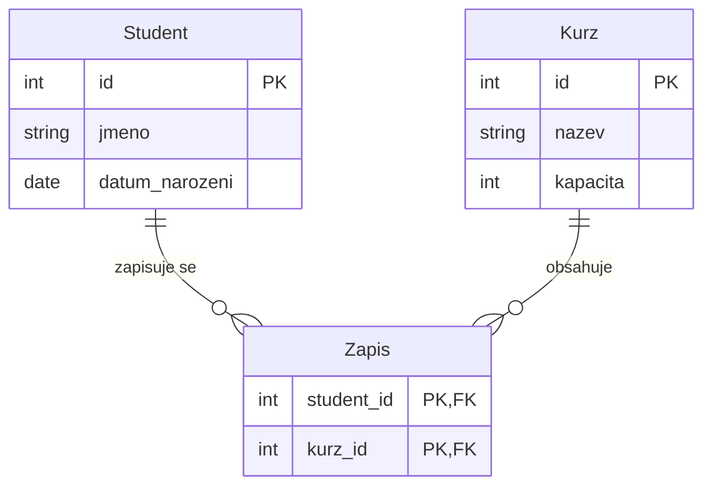
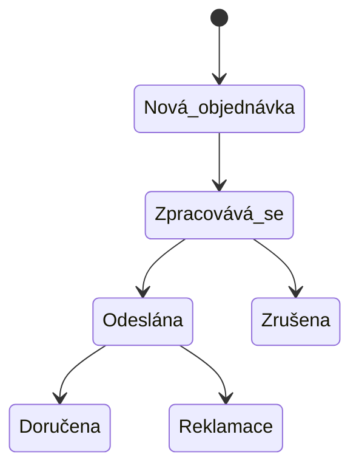
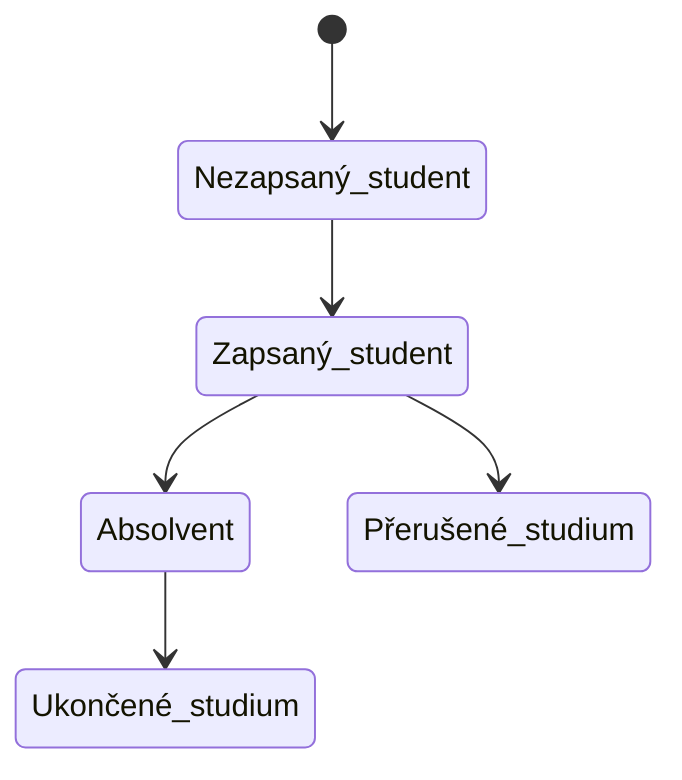

![[Okruhy#^666d02]]
### Konceptuální a datový model

**Entity-Relationship Diagram (ERD):**


**Schéma databáze:**
```sql
CREATE TABLE Student (
    id INT PRIMARY KEY,
    jméno VARCHAR(50),
    datum_narození DATE
);

CREATE TABLE Kurz (
    id INT PRIMARY KEY,
    název VARCHAR(100),
    kapacita INT
);

CREATE TABLE Zápis (
    student_id INT,
    kurz_id INT,
    PRIMARY KEY (student_id, kurz_id),
    FOREIGN KEY (student_id) REFERENCES Student(id),
    FOREIGN KEY (kurz_id) REFERENCES Kurz(id)
);
```

### Stavová analýza

**Stavový diagram pro proces objednávky:**


**Stavový diagram pro studentskou registraci:**


### Funkční analýza – minispecifikace

**Minispecifikace: Vložení nového studenta**

- **Vstupy:**
  - `jméno`: Řetězec (např. 'Jan Novák')
  - `datum_narození`: Datum (např. '2000-01-01')

- **Výstupy:**
  - Nový záznam v tabulce `Student`

- **Popis:**
  - Funkce vloží nového studenta do databáze. Nejprve ověří, že jméno a datum narození nejsou prázdné. Poté vygeneruje nové ID pro studenta a vloží záznam do tabulky `Student`.

- **SQL kód:**
  ```sql
  CREATE OR REPLACE PROCEDURE VlozitStudenta (
      p_jméno IN VARCHAR2,
      p_datum_narození IN DATE
  ) AS
      v_id INT;
  BEGIN
      -- Generování nového ID
      SELECT NVL(MAX(id), 0) + 1 INTO v_id FROM Student;
      
      -- Vložení nového studenta
      INSERT INTO Student (id, jméno, datum_narození) VALUES (v_id, p_jméno, p_datum_narození);
  END;
  ```

### Návrh formulářů

**Formulář pro vložení nového studenta:**

**Mockup formuláře:**
```plaintext
-------------------------------------------------
| Formulář pro vložení nového studenta           |
-------------------------------------------------
| Jméno:          ___________________________    |
| Datum narození: ___________________________    |
|                                                 |
| [ Uložit ]                                      |
-------------------------------------------------
```

**HTML kód:**
```html
<form action="/vlozit_studenta" method="post">
    <label for="jmeno">Jméno:</label>
    <input type="text" id="jmeno" name="jmeno" required>
    <br>
    <label for="datum_narozeni">Datum narození:</label>
    <input type="date" id="datum_narozeni" name="datum_narozeni" required>
    <br>
    <button type="submit">Uložit</button>
</form>
```

### Shrnutí

Analýza informačního systému zahrnuje:
- **Konceptuální a datový model**: Identifikace entit, atributů a vztahů, následně detailní definice tabulek a jejich struktury.
- **Stavová analýza**: Identifikace stavů systému a přechodů mezi nimi.
- **Funkční analýza – minispecifikace**: Definování funkcionality systému a detailní popisy jednotlivých funkcí.
- **Návrh formulářů**: Vytváření uživatelských rozhraní pro interakci se systémem.

Tyto kroky zajišťují, že informační systém bude splňovat požadavky uživatelů a bude dobře strukturovaný a snadno udržovatelný.