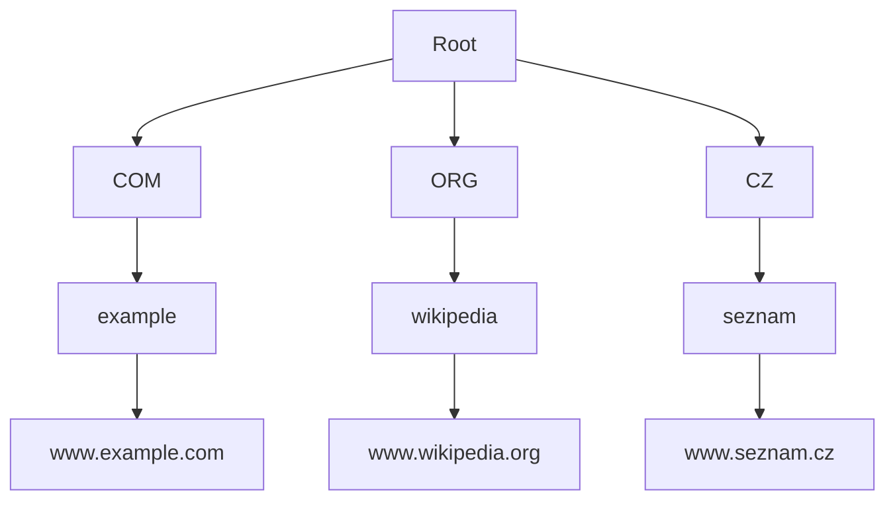

![[Okruhy#^d4c323]]

#### Elektronická pošta

Elektronická pošta (e-mail) je jedna z nejstarších a nejpoužívanějších služeb na Internetu. Pro e-mail existuje několik klíčových protokolů:

1. **SMTP (Simple Mail Transfer Protocol)**:
   - Protokol pro odesílání e-mailů.
   - Používá se k přenosu zpráv mezi servery a z klienta na server.
   - Používá port 25 (někdy 587 pro autentifikovaný přenos).

2. **POP3 (Post Office Protocol 3)**:
   - Protokol pro stahování e-mailů z poštovního serveru na klienta.
   - Stahuje všechny e-maily a obvykle je po stažení smaže ze serveru.
   - Používá port 110 (nebo 995 pro SSL/TLS).

3. **IMAP (Internet Message Access Protocol)**:
   - Protokol pro přístup k e-mailům na serveru.
   - Umožňuje spravovat složky na serveru a neodstraňuje zprávy po stažení.
   - Používá port 143 (nebo 993 pro SSL/TLS).

#### Protokol HTTP

**HTTP (HyperText Transfer Protocol)** je základní protokol pro přenos webových stránek a dalších zdrojů na internetu.

- **HTTP/1.1**:
  - Původní verze HTTP, která podporuje udržování spojení a řadu optimalizací pro efektivní přenos.
  - Používá port 80 pro nešifrovaný přenos.

- **HTTPS (HTTP Secure)**:
  - Šifrovaná verze HTTP, která používá SSL/TLS pro zabezpečení přenosu dat.
  - Používá port 443.

- **HTTP/2**:
  - Moderní verze HTTP, která zlepšuje výkon pomocí binárního formátu, multiplexování, komprese hlaviček a prioritizace.
  - Vyžaduje TLS pro zabezpečení.

#### DNS (Domain Name System)

DNS je systém, který překládá doménová jména na IP adresy, což umožňuje snadnou navigaci na internetu.

**Typy záznamů**:

1. **A (Address)**:
   - Překládá doménové jméno na IPv4 adresu.
   
2. **AAAA (IPv6 Address)**:
   - Překládá doménové jméno na IPv6 adresu.

3. **CNAME (Canonical Name)**:
   - Alias pro jiné doménové jméno.

4. **MX (Mail Exchange)**:
   - Určuje mailové servery pro doménu.

5. **TXT (Text)**:
   - Obsahuje textové informace, často používané pro ověření a zabezpečení (např. SPF, DKIM).

6. **NS (Name Server)**:
   - Určuje autoritativní jmenné servery pro doménu.

7. **PTR (Pointer)**:
   - Používá se pro reverzní DNS, překládá IP adresy na doménová jména.

**Doménový strom**:

- DNS používá hierarchickou strukturu domén, začínající od kořenové domény (root).
- Domény nejvyšší úrovně (TLD) zahrnují generické TLD (např. .com, .org) a kódové TLD pro země (např. .cz, .uk).
- Pod TLD jsou domény druhé úrovně (např. example.com) a další podúrovně.

**Zóny**:

- **Zóna** je část doménového stromu, kterou spravuje jeden administrativní subjekt.
- Každá zóna obsahuje záznamy DNS pro domény v této zóně.
- Zóny jsou spravovány autoritativními DNS servery.

**Zabezpečení DNS**:

- **DNSSEC (DNS Security Extensions)**:
  - Rozšíření DNS, které poskytuje autentizaci původu dat a integritu.
  - Zajišťuje, že odpovědi DNS nejsou podvrženy nebo modifikovány.

#### SSH (Secure Shell)

**SSH** je protokol pro bezpečnou vzdálenou správu a přenos dat mezi počítači.

- **Port**: SSH používá standardně port 22.
- **Autentizace**: Podporuje různé metody autentizace, včetně hesel a veřejných klíčů.
- **Šifrování**: Všechen přenos dat je šifrován, což zajišťuje důvěrnost a integritu.
- **Tunelování**: SSH může tunelovat jiné protokoly (např. HTTP) přes zabezpečené spojení.
- **Příkazy**:
  - `ssh user@hostname` pro přihlášení k vzdálenému serveru.
  - `scp source_file user@hostname:destination_path` pro zabezpečený přenos souborů.

### Shrnutí

Služby internetu a jejich protokoly zahrnují širokou škálu technologií, které umožňují komunikaci a správu dat na internetu. Elektronická pošta používá protokoly jako SMTP, POP3 a IMAP. HTTP je základní protokol pro webové stránky, zatímco DNS překládá doménová jména na IP adresy a zajišťuje navigaci na internetu. SSH poskytuje bezpečný způsob pro vzdálenou správu a přenos dat. Každá z těchto služeb a protokolů hraje klíčovou roli v fungování moderního internetu.