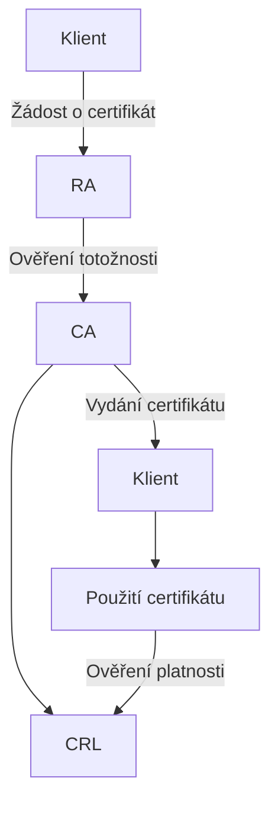

![[Okruhy#^c62e63]]

Kryptografie je věda o zabezpečení komunikace prostřednictvím technik, které chrání informace před neoprávněným přístupem nebo modifikací. Zahrnuje několik základních konceptů a technologií.

#### Blokové a proudové šifry

**Blokové šifry**:
- Zpracovávají data v pevných velikostech bloků (typicky 64 nebo 128 bitů).
- Každý blok dat je šifrován samostatně pomocí stejného klíče.
- Režimy provozu blokových šifer určují, jak jsou jednotlivé bloky zpracovávány:
  - **ECB (Electronic Codebook)**: Každý blok je šifrován nezávisle. Nevýhoda: shodné bloky mají shodné šifrové texty.
  - **CBC (Cipher Block Chaining)**: Každý blok je XORován s předchozím šifrovým blokem před šifrováním. Vyžaduje inicializační vektor (IV).
  - **CFB (Cipher Feedback)**: Podobný CBC, ale bloky jsou zpracovávány v menších částech.
  - **OFB (Output Feedback)**: Používá šifrovou zpětnou vazbu pro generování klíče, nezávisí na šifrovém textu.
  - **CTR (Counter)**: Používá čítač, který se inkrementuje s každým blokem. Podporuje paralelní šifrování.

**Proudové šifry**:
- Zpracovávají data jako proud bajtů nebo bitů, nikoli jako pevné bloky.
- Generují pseudonáhodný klíčový proud, který je XORován s plaintextem.
- Příklady: RC4, Salsa20.

#### Symetrická a asymetrická kryptografie

**Symetrická kryptografie**:
- Používá jeden klíč pro šifrování i dešifrování.
- Výhody: Rychlost, efektivita.
- Nevýhody: Potřeba bezpečného sdílení klíče.
- Příklady: AES (Advanced Encryption Standard), DES (Data Encryption Standard), 3DES (Triple DES).

**Asymetrická kryptografie**:
- Používá dvojici klíčů: veřejný klíč pro šifrování a soukromý klíč pro dešifrování.
- Výhody: Není potřeba sdílet tajný klíč.
- Nevýhody: Pomalejší než symetrická kryptografie.
- Příklady: RSA, ECC (Elliptic Curve Cryptography).

**Využití**:
- Symetrická kryptografie je často používána pro šifrování velkých objemů dat.
- Asymetrická kryptografie se používá pro výměnu klíčů, digitální podpisy a šifrování malých datových objemů.

#### Hashovací funkce

**Hashovací funkce**:
- Převádějí libovolně velký vstup na pevně velký výstup (hash).
- Vlastnosti: Deterministické, rychlé, odolné proti kolizím (různé vstupy nesmí produkovat stejný hash).
- Příklady: SHA-256 (Secure Hash Algorithm), MD5 (Message Digest Algorithm 5), SHA-3.

**Použití**:
- Ověření integrity dat.
- Digitální podpisy.
- Ukládání hesel (hesla se neukládají přímo, ale jejich hashe).

#### Infrastruktura veřejného klíče (PKI)

**PKI** je systém pro správu veřejných a soukromých klíčů a digitálních certifikátů. Zahrnuje několik základních komponent:

1. **Certifikační autorita (CA)**:
   - Důvěryhodná třetí strana, která vydává digitální certifikáty.
   - Certifikát potvrzuje totožnost subjektu a obsahuje veřejný klíč.

2. **Registrátor (RA)**:
   - Zpracovává žádosti o certifikáty a ověřuje totožnost žadatelů před předáním žádosti CA.

3. **Digitální certifikát**:
   - Elektronický dokument, který obsahuje veřejný klíč a informace o identitě vlastníka (např. jméno, e-mail, organizace).
   - Podepsán certifikační autoritou, což zaručuje jeho platnost.

4. **Certifikační seznam (CRL)**:
   - Seznam zneplatněných certifikátů, které již nemají být důvěryhodné.

5. **Klientské aplikace**:
   - Používají digitální certifikáty k ověřování totožnosti a šifrování komunikace.

### Shrnutí

Kryptografie poskytuje základní technologie pro zabezpečení dat a komunikace. Symetrická a asymetrická kryptografie, hashovací funkce a infrastruktura veřejného klíče jsou klíčovými komponentami moderních bezpečnostních systémů. Každý z těchto prvků má své specifické využití a přispívá k celkové bezpečnosti informačních systémů.