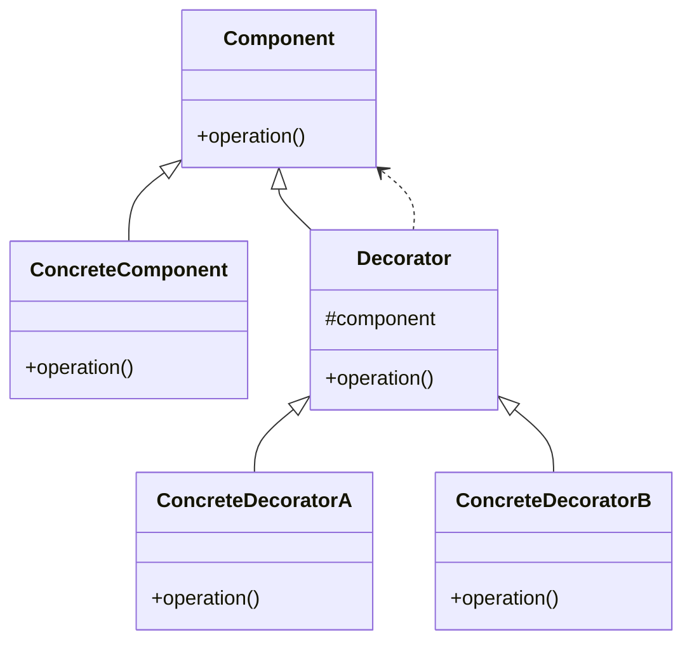

![[Okruhy#^43b07f]]

Návrhové vzory a praktiky jsou důležitými nástroji pro efektivní a kvalitní vývoj informačních systémů. Tyto vzory poskytují osvědčená řešení běžných problémů a zlepšují strukturu, udržovatelnost a flexibilitu kódu.

#### Vzory GoF (Gang of Four)

Vzory GoF jsou základní návrhové vzory, které byly popsány ve známé knize "Design Patterns: Elements of Reusable Object-Oriented Software" od Ericha Gamma, Richarda Helma, Ralpha Johnsona a Johna Vlissidese. Tyto vzory se dělí do tří kategorií:

1. **Creational (tvořivé) vzory**:
   - **Abstract Factory**: Poskytuje rozhraní pro vytváření rodin souvisejících nebo závislých objektů bez specifikace jejich konkrétních tříd.
   - **Builder**: Odděluje konstrukci složitého objektu od jeho reprezentace, což umožňuje stejný konstrukční proces vytvářet různé reprezentace.
   - **Factory Method**: Definuje rozhraní pro vytváření objektu, ale nechává podtřídám rozhodnout, jakou třídu instancí vytvořit.
   - **Prototype**: Umožňuje klonování objektů pomocí prototypu namísto jejich vytváření od nuly.
   - **Singleton**: Zajišťuje, že třída má pouze jednu instanci, a poskytuje globální přístupový bod k této instanci.

2. **Structural (strukturální) vzory**:
   - **Adapter**: Umožňuje spolupráci mezi neslučitelnými rozhraními tak, že jedno rozhraní přizpůsobí jinému.
   - **Bridge**: Odděluje abstrakci od její implementace, což umožňuje, aby mohly být obě nezávisle změněny.
   - **Composite**: Skládá objekty do stromové struktury pro reprezentaci hierarchie část-celku, což umožňuje klientům zacházet s jednotlivými objekty a jejich složením jednotně.
   - **Decorator**: Dynamicky přidává odpovědnosti objektům tím, že je obaluje do jiných objektů.
   - **Facade**: Poskytuje jednotné rozhraní k sadě rozhraní v podkladových subsystémech.
   - **Flyweight**: Efektivně podporuje velké množství malých objektů tím, že sdílí co nejvíce dat.
   - **Proxy**: Poskytuje zástupný objekt, který řídí přístup k jinému objektu.

3. **Behavioral (behaviorální) vzory**:
   - **Chain of Responsibility**: Deleguje požadavek na objekty v řetězci, dokud není požadavek zpracován.
   - **Command**: Přeměňuje požadavky nebo jednoduché operace do objektů.
   - **Interpreter**: Definuje gramatiku pro jazyk a interpretuje věty v tomto jazyce.
   - **Iterator**: Poskytuje sekvenční přístup k prvkům agregovaného objektu, aniž by odhaloval jeho podkladovou reprezentaci.
   - **Mediator**: Definuje objekt, který zapouzdřuje způsob, jakým soubor objektů spolu interaguje.
   - **Memento**: Umožňuje zachytit a externalizovat vnitřní stav objektu, aniž by došlo k porušení zapouzdření, takže objekt může být vrácen do tohoto stavu později.
   - **Observer**: Definuje závislost 1: mnoho mezi objekty, takže když se změní stav jednoho objektu, všechny jeho závislé objekty jsou upozorněny a automaticky aktualizovány.
   - **State**: Umožňuje objektu měnit své chování, když se změní jeho vnitřní stav.
   - **Strategy**: Definuje rodinu algoritmů, zapouzdří každý z nich a činí je zaměnitelnými.
   - **Template Method**: Definuje kostru algoritmu v metodě, přičemž některé kroky deleguje na podtřídy.
   - **Visitor**: Představuje operaci, která se má provádět na prvcích struktury objektu.

#### Vzory doménové logiky

Vzory doménové logiky se zaměřují na organizaci byznys logiky v aplikaci. Mezi hlavní vzory patří:

1. **Transaction Script**:
   - Organizes business logic by procedures where each procedure handles a single request from the presentation.
   - Vhodný pro jednoduché aplikace s malým množstvím byznys logiky.

2. **Domain Model**:
   - An object model of the domain that incorporates both behavior and data.
   - Vhodný pro složitější aplikace s bohatou doménovou logikou.

3. **Table Module**:
   - A single instance that handles the business logic for all rows in a database table or view.
   - Vhodný pro aplikace, kde byznys logika je úzce spjata s daty v databázi.

4. **Service Layer**:
   - Defines an application's boundary with a layer of services that establishes a set of available operations and coordinates the application's response in each operation.
   - Vhodný pro aplikace s komplexními operacemi a potřebou jasně definovaných služeb.

#### Vzory pro práci s datovými zdroji

Vzory pro práci s datovými zdroji se zaměřují na způsoby, jakým aplikace komunikuje s databází a jinými úložišti dat:

1. **Table Data Gateway**:
   - An object that acts as a gateway to a database table. One instance handles all the rows in the table.
   - Vhodný pro jednoduchou doménovou logiku a práci s transakčními skripty.

2. **Row Data Gateway**:
   - An object that acts as a gateway to a single record in a data source. There is one instance per row.
   - Vhodný pro práci s jednoduchou doménovou logikou.

3. **Active Record**:
   - An object that wraps a row in a database table or view, encapsulates the database access, and adds domain logic on that data.
   - Vhodný pro složitější doménovou logiku s jednoduchými operacemi přímo mapovanými na tabulky.

4. **Data Mapper**:
   - A layer of mappers that moves data between objects and a database while keeping them independent of each other and the mapper itself.
   - Vhodný pro složitou doménovou logiku a potřebu nezávislosti mezi objekty a databází.

#### Vzory objektově-relačního chování a struktury

Tyto vzory se zaměřují na způsoby mapování objektů na relační databáze:

1. **Identity Field**:
   - Saves a database ID field in an object to maintain identity between an in-memory object and a database row.

2. **Foreign Key Mapping**:
   - Maps an association between objects to a foreign key reference between tables.

3. **Association Table Mapping**:
   - Saves an association as a table with foreign keys to the tables that are linked by the association.

4. **Dependent Mapping**:
   - Has one class perform the database mapping for a child class.

5. **Embedded Value**:
   - Maps an object into several fields of another object's table.

6. **Serialized LOB**:
   - Saves a graph of objects by serializing them into a single large object (LOB), which it stores in a database field.

#### Vzory objektově-relačního chování

1. **Unit of Work**:
   - Maintains a list of objects affected by a business transaction and coordinates the writing out of changes and the resolution of concurrency problems.

2. **Identity Map**:
   - Ensures that each object gets loaded only once by keeping every loaded object in a map. Looks up objects using the map when referring to them.

3. **Lazy Load**:
   - An object that doesn't contain all of the data you need but knows how to get it.

#### Doménově specifické jazyky (DSL)

Doménově specifické jazyky jsou programovací jazyky určené pro specifické domény, což usnadňuje vyjadřování a práci v těchto doménách:

1. **External DSL**:
   - Language separate from the main language of the application it works with (e.g. XML, SQL, regular expressions).

2. **Internal DSL**:
   - A particular way of using a general-purpose language to make it more expressive for a specific domain.

3. **Language Workbench**:
   - A specialized IDE for defining and building DSLs.

Doménově specifické jazyky zlepšují produktivitu vývojářů a usnadňují komunikaci s doménovými experty, ale mohou mít také problémy jako "language cacoph

ony" nebo náklady na vývoj a údržbu.

### Závěr

Návrhové vzory a praktiky jsou klíčové pro efektivní vývoj informačních systémů. Poskytují osvědčené řešení pro různé problémy, zlepšují strukturu kódu a usnadňují jeho údržbu. Je důležité vybrat správné vzory podle specifických potřeb a kontextu projektu.


### Návrhové vzory a praktiky pro vývoj informačních systémů s diagramy v Mermaid

#### Vzory GoF (Gang of Four)

1. **Abstract Factory**:


2. **Builder**:


3. **Factory Method**:


4. **Prototype**:


5. **Singleton**:


6. **Adapter**:


7. **Bridge**:


8. **Composite**:


9. **Decorator**:


10. **Facade**:


11. **Flyweight**:


12. **Proxy**:


13. **Chain of Responsibility**:


14. **Command**:


15. **Interpreter**:


16. **Iterator**:


17. **Mediator**:


18. **Memento**:


19. **Observer**:


20. **State**:


21. **Strategy**:
```mermaid
classDiagram
    class Strategy {
        +algorithmInterface()
    }
    class ConcreteStrategyA {
        +algorithmInterface()
    }
    class ConcreteStrategyB {
        +algorithmInterface()
    }
    class Context {
        +setStrategy()
        +contextInterface()
    }
    


    Strategy <|-- ConcreteStrategyA
    Strategy <|-- ConcreteStrategyB
    Context ..> Strategy
```

22. **Template Method**:
```mermaid
classDiagram
    class AbstractClass {
        +templateMethod()
        +primitiveOperation1()
        +primitiveOperation2()
    }
    class ConcreteClass {
        +primitiveOperation1()
        +primitiveOperation2()
    }
    
    AbstractClass <|-- ConcreteClass
```

23. **Visitor**:
```mermaid
classDiagram
    class Visitor {
        +visitElementA()
        +visitElementB()
    }
    class ConcreteVisitor1 {
        +visitElementA()
        +visitElementB()
    }
    class ConcreteVisitor2 {
        +visitElementA()
        +visitElementB()
    }
    class Element {
        +accept()
    }
    class ConcreteElementA {
        +accept()
    }
    class ConcreteElementB {
        +accept()
    }
    
    Visitor <|-- ConcreteVisitor1
    Visitor <|-- ConcreteVisitor2
    Element <|-- ConcreteElementA
    Element <|-- ConcreteElementB
    Element --> Visitor
```

#### Vzory doménové logiky

1. **Transaction Script**:
```mermaid
classDiagram
    class TransactionScript {
        +execute()
    }
    class Task1 {
        +execute()
    }
    class Task2 {
        +execute()
    }
    
    TransactionScript --> Task1
    TransactionScript --> Task2
```

2. **Domain Model**:
```mermaid
classDiagram
    class DomainModel {
        +behavior()
    }
    class Entity {
        +attribute
        +behavior()
    }
    class ValueObject {
        +attribute
    }
    
    DomainModel --> Entity
    DomainModel --> ValueObject
```

3. **Table Module**:
```mermaid
classDiagram
    class TableModule {
        +operation()
    }
    class Table {
        +row1
        +row2
    }
    
    TableModule --> Table
```

4. **Service Layer**:
```mermaid
classDiagram
    class ServiceLayer {
        +operation()
    }
    class BusinessLogic {
        +operation()
    }
    
    ServiceLayer --> BusinessLogic
```

#### Vzory pro práci s datovými zdroji

1. **Table Data Gateway**:
```mermaid
classDiagram
    class TableDataGateway {
        +find()
        +update()
        +delete()
    }
    class DatabaseTable {
        +row
    }
    
    TableDataGateway --> DatabaseTable
```

2. **Row Data Gateway**:
```mermaid
classDiagram
    class RowDataGateway {
        +find()
        +update()
        +delete()
    }
    class DatabaseRow {
        +data
    }
    
    RowDataGateway --> DatabaseRow
```

3. **Active Record**:
```mermaid
classDiagram
    class ActiveRecord {
        +save()
        +delete()
        +find()
    }
    class DatabaseRow {
        +data
    }
    
    ActiveRecord --> DatabaseRow
```

4. **Data Mapper**:
```mermaid
classDiagram
    class DataMapper {
        +save()
        +delete()
        +find()
    }
    class DomainObject {
        +data
    }
    class DatabaseRow {
        +data
    }
    
    DataMapper --> DomainObject
    DataMapper --> DatabaseRow
```

#### Vzory objektově-relačního chování a struktury

1. **Identity Field**:
```mermaid
classDiagram
    class IdentityField {
        +id
    }
    class DomainObject {
        +attribute
    }
    
    IdentityField <|-- DomainObject
```

2. **Foreign Key Mapping**:
```mermaid
classDiagram
    class ForeignKeyMapping {
        +foreignKey
    }
    class Table1 {
        +data
    }
    class Table2 {
        +data
    }
    
    ForeignKeyMapping --> Table1
    ForeignKeyMapping --> Table2
```

3. **Association Table Mapping**:
```mermaid
classDiagram
    class AssociationTable {
        +foreignKey1
        +foreignKey2
    }
    class Table1 {
        +data
    }
    class Table2 {
        +data
    }
    
    AssociationTable --> Table1
    AssociationTable --> Table2
```

4. **Dependent Mapping**:
```mermaid
classDiagram
    class DependentClass {
        +data
    }
    class ParentClass {
        +data
    }
    
    ParentClass --> DependentClass
```

5. **Embedded Value**:
```mermaid
classDiagram
    class EmbeddedValue {
        +value1
        +value2
    }
    class ContainerClass {
        +attribute
    }
    
    ContainerClass --> EmbeddedValue
```

6. **Serialized LOB**:
```mermaid
classDiagram
    class SerializedLOB {
        +data
    }
    class ObjectGraph {
        +objectData
    }
    
    SerializedLOB --> ObjectGraph
```

#### Vzory objektově-relačního chování

1. **Unit of Work**:
```mermaid
classDiagram
    class UnitOfWork {
        +commit()
        +registerNew()
        +registerDirty()
        +registerClean()
        +registerDeleted()
    }
    class DomainObject {
        +data
    }
    
    UnitOfWork --> DomainObject
```

2. **Identity Map**:
```mermaid
classDiagram
    class IdentityMap {
        +get()
        +put()
    }
    class DomainObject {
        +data
    }
    
    IdentityMap --> DomainObject
```

3. **Lazy Load**:
```mermaid
classDiagram
    class LazyLoad {
        +load()
    }
    class DomainObject {
        +data
    }
    
    LazyLoad --> DomainObject
```

#### Doménově specifické jazyky (DSL)

1. **External DSL**:
```mermaid
classDiagram
    class ExternalDSL {
        +parse()
        +execute()
    }
    class Script {
        +code
    }
    
    ExternalDSL --> Script
```

2. **Internal DSL**:
```mermaid
classDiagram
    class InternalDSL {
        +execute()
    }
    class GeneralPurposeLanguage {
        +syntax
    }
    
    InternalDSL --> GeneralPurposeLanguage
```

3. **Language Workbench**:
```mermaid
classDiagram
    class LanguageWorkbench {
        +defineDSL()
        +buildDSL()
    }
    class DSL {
        +syntax
        +semantics
    }
    
    LanguageWorkbench --> DSL
```

Tyto diagramy v mermaid formátu vizualizují strukturu a vztahy jednotlivých návrhových vzorů a praktik používaných při vývoji informačních systémů.