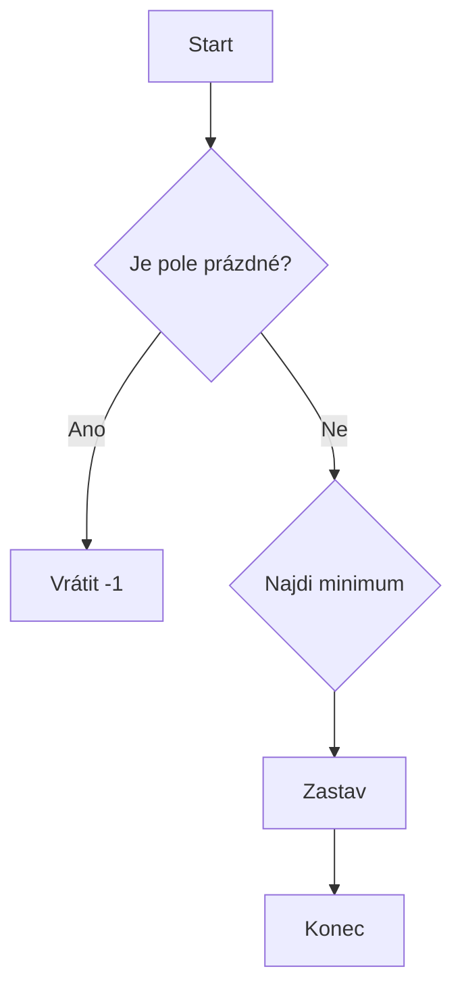

![[Okruhy#^3e78ab]]

### Složitost algoritmů

Složitost algoritmů je klíčovým aspektem v oblasti informatiky, protože nám umožňuje porovnávat efektivitu různých algoritmů. Složitost se obvykle vyjadřuje pomocí asymptotické notace, která popisuje růstovou míru výpočetních zdrojů potřebných algoritmem v závislosti na velikosti vstupu.

#### Asymptotická notace

Asymptotická notace se používá k vyjádření horních, dolních a těsných hranic složitosti algoritmů. Zde jsou nejdůležitější typy asymptotické notace:

1. **O-velké (Big-O) notace**:
   - Vyjadřuje horní hranici růstové míry algoritmu.
   - Používá se k popisu nejhoršího možného scénáře.
   - Příklad: Pokud algoritmus má časovou složitost ( $O(n^2)$), znamená to, že jeho běh nebude trvat déle než nějaká konstanta krát ($n^2$) pro dostatečně velké ( $n$ ).

$$ O(f(n)) = \{ g(n) \mid \exists c > 0, \exists n_0 \text{ tak, že } g(n) \leq c \cdot f(n) \text{ pro všechna } n \geq n_0 \}$$

2. **Ω-velké (Big-Omega) notace**:
   - Vyjadřuje dolní hranici růstové míry algoritmu.
   - Používá se k popisu nejlepšího možného scénáře.

$$\Omega(f(n)) = \{ g(n) \mid \exists c > 0, \exists n_0 \text{ tak, že } g(n) \geq c \cdot f(n) \text{ pro všechna } n \geq n_0 \}$$

3. **Θ-velké (Big-Theta) notace**:
   - Vyjadřuje těsnou hranici růstové míry algoritmu.
   - Znamená to, že algoritmus má asymptoticky stejnou horní a dolní hranici.

$$\Theta(f(n)) = \{ g(n) \mid \exists c_1, c_2 > 0, \exists n_0 \text{ tak, že } c_1 \cdot f(n) \leq g(n) \leq c_2 \cdot f(n) \text{ pro všechna } n \geq n_0 \} $$

#### Seřazení algoritmů podle časové složitosti

1. **$O(1)$ - Konstantní časová složitost**
   - Příklad: Přístup k prvku pole, jednoduché přiřazení.

2. **$O((\log n))$ - Logaritmická časová složitost**
   - Příklad: Binární vyhledávání (Binary Search).

3. **$O(n)$ - Lineární časová složitost**
   - Příklad: Lineární vyhledávání (Linear Search), iterace přes pole.

4. **$O(n (\log n))$ - Lineárně-logaritmická časová složitost**
   - Příklad: Rychlé třídění (Quicksort), Slévání řazených polí (Merge Sort), Haldové třídění (Heapsort).

5. **$O(n^2)$ - Kvadratická časová složitost**
   - Příklad: Bublinkové třídění (Bubble Sort), Vkládací třídění (Insertion Sort), Výběrové třídění (Selection Sort).

6. **$O(n^3)$ - Kubická časová složitost**
   - Příklad: Algoritmus pro násobení matic základním způsobem.

7. **$O(2^n)$ - Exponenciální časová složitost**
   - Příklad: Prohledávání všech podmnožin (Subset Sum problem), některé rekurzivní řešení problémů.

8. **$O(n!)$ - Faktoriální časová složitost**
   - Příklad: Generování všech permutací, některé problémy z oblasti teorie grafů.

### Tabulka časové složitosti

| Časová složitost | Příklady algoritmů                                                                                     |
| ---------------- | ------------------------------------------------------------------------------------------------------ |
| $O(1)$           | Přístup k prvku pole, jednoduché přiřazení                                                             |
| $O((\log n))$    | Binární vyhledávání (Binary Search)                                                                    |
| $O(n)$           | Lineární vyhledávání (Linear Search), iterace přes pole                                                |
| $O(n (\log n))$  | Rychlé třídění (Quicksort), Slévání řazených polí (Merge Sort), Haldové třídění (Heapsort)             |
| $O(n^2)$         | Bublinkové třídění (Bubble Sort), Vkládací třídění (Insertion Sort), Výběrové třídění (Selection Sort) |
| $O(n^3)$         | Násobení matic základním způsobem                                                                      |
| $O(2^n)$         | Prohledávání všech podmnožin (Subset Sum problem), některé rekurzivní algoritmy                        |
| $O(n!)$          | Generování všech permutací, některé problémy z oblasti teorie grafů                                    |

#### Korektnost algoritmů a její analýza

Korektnost algoritmu znamená, že algoritmus dává správné výsledky pro všechny možné vstupy. Analýza korektnosti se obvykle skládá ze dvou částí:

1. **Částečná korektnost**:
   - Algoritmus produkuje správné výstupy, pokud se zastaví.
   - Obvykle se dokazuje pomocí invariantů smyček nebo indukcí.

2. **Úplná korektnost**:
   - Algoritmus se zastaví pro všechny možné vstupy.
   - Kombinuje částečnou korektnost s důkazem, že algoritmus vždy skončí.

**Příklad důkazu korektnosti (pro algoritmus hledání minima v poli):**

1. **Částečná korektnost**: Ukážeme, že pokud se algoritmus zastaví, nalezený prvek je skutečně minimum.

$$ \text{Invarianta smyčky: } \forall j \in \{0, 1, \ldots, i\}, \text{ platí } A[\text{min\_index}] \leq A[j] $$

2. **Úplná korektnost**: Ukážeme, že algoritmus se zastaví po konečném počtu kroků.

$$ \text{Počet iterací smyčky: } n \text{, kde } n \text{ je délka pole}$$

### Příklad asymptotické analýzy

Pro analýzu složitosti algoritmu používáme často asymptotickou notaci. Například:

**Algoritmus pro lineární vyhledávání:**

```python
def linear_search(arr, target):
    for i in range(len(arr)):
        if arr[i] == target:
            return i
    return -1
```

**Časová složitost:**
$$
T(n) = O(n)
$$
**Prostorová složitost:**
$$S(n) = O(1)$$

### Mermaid: Příklad korektnosti algoritmu



Tento diagram znázorňuje základní tok algoritmu pro hledání minima v poli. Pokud je pole prázdné, algoritmus vrátí -1, jinak pokračuje hledáním minima.

Doufám, že ti tyto informace pomohou při přípravě na státní závěrečné zkoušky. Pokud máš další otázky nebo potřebuješ další podrobnosti, neváhej se zeptat!