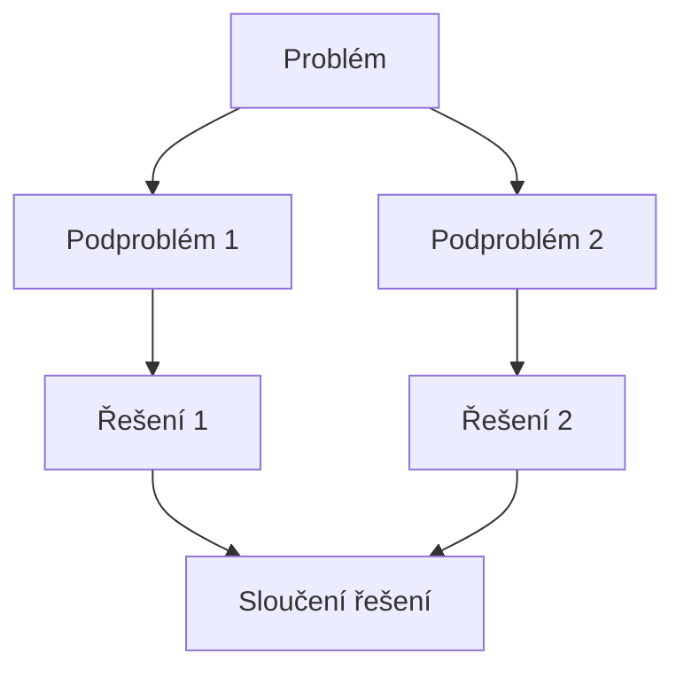
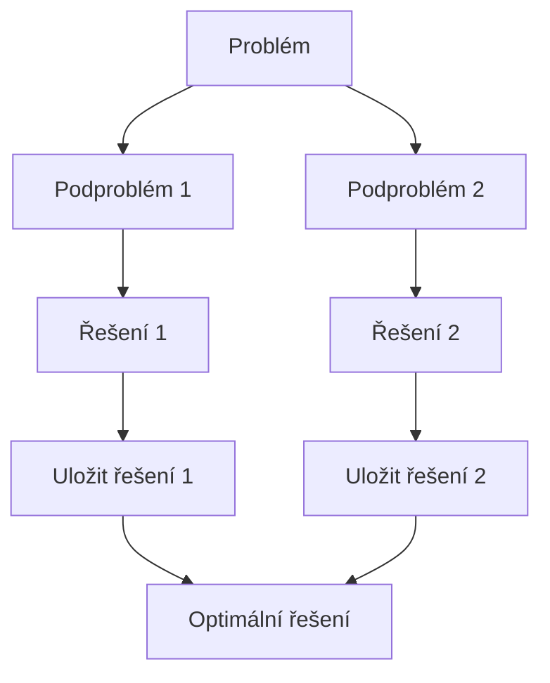

![[Okruhy#^a289c5]]

### Strategie algoritmického řešení problémů

Algoritmické řešení problémů se často dělí na různé strategie podle způsobu, jakým jsou problémy řešeny. Níže jsou popsány některé z nejdůležitějších strategií:

#### 1. Strategie hrubou silou (Brute Force)
Hrubá síla znamená vyzkoušet všechny možné varianty řešení problému a vybrat tu nejlepší. Je to často nejjednodušší způsob, jak přistupovat k problému, ale také nejméně efektivní.

**Příklady:**
- Prohledávání všech možných kombinací při luštění šifry.
- Generování všech permutací prvků a hledání optimálního řešení.

#### 2. Úplné prohledávání (Exhaustive Search)
Úplné prohledávání je systematické prohledávání všech možných řešení problému. Na rozdíl od hrubé síly se zde často používají sofistikované techniky pro efektivnější prohledávání.

**Příklady:**
- Prohledávání stromu stavů u her, jako je šachy nebo go.
- Backtracking pro řešení sudoku.

#### 3. Sniž a vyřeš (Decrease and Conquer)
Tato strategie zahrnuje rozdělení problému na menší části a postupné řešení těchto částí. Původní problém je řešen pomocí řešení těchto menších částí.

**Příklady:**
- Binární vyhledávání (Binary Search).
- Algoritmus pro výpočet mocniny.

#### 4. Rozděl a panuj (Divide and Conquer)
Rozděl a panuj znamená rozdělit problém na menší podproblémy, řešit každý podproblém nezávisle a následně kombinovat řešení těchto podproblémů pro získání řešení původního problému.

**Příklady:**
- Rychlé třídění (Quicksort).
- Slévání řazených polí (Merge Sort).

#### 5. Transformuj a vyřeš (Transform and Conquer)
Tato strategie zahrnuje transformaci problému na jiný problém, který je jednodušší řešit. Po transformaci je problém vyřešen a výsledek je přetransformován zpět.

**Příklady:**
- Heapsort: Transformace pole na binární haldu a následné třídění.
- Použití grafových algoritmů na řešení problémů v síťové analýze.

#### 6. Záměna paměťové a časové složitosti (Space-Time Tradeoff)
Záměna paměti a času znamená optimalizaci algoritmu tak, aby využíval více paměti ke snížení časové složitosti nebo naopak.

**Příklady:**
- Tabulace (memoization) v dynamickém programování.
- Použití hashovacích tabulek pro rychlejší přístup k datům.

#### 7. Dynamické programování (Dynamic Programming)
Dynamické programování je metoda, která řeší problémy rozdělením na překrývající se podproblémy, jejichž řešení jsou uložena, aby se zabránilo jejich opětovnému řešení.

**Příklady:**
- Fibonacciho čísla.
- Problém batohu (Knapsack Problem).

#### 8. Hladové algoritmy (Greedy Algorithms)
Hladové algoritmy dělají lokálně optimální volby v každém kroku s nadějí, že dosáhnou globálního optima.

**Příklady:**
- Algoritmus pro nalezení minimální kostry grafu (Kruskalův a Primův algoritmus).
- Algoritmus pro nalezení optimální cesty (Dijkstrův algoritmus).

### Příklad dynamického programování
Dynamické programování často zahrnuje rekurzivní rovnice. Například, rekurzivní definice Fibonacciho čísel může být zapsána jako:

$$
 F(n) = 
\begin{cases} 
0 & \text{if } n = 0 \\
1 & \text{if } n = 1 \\
F(n-1) + F(n-2) & \text{if } n > 1 
\end{cases}
$$

Doufám, že ti tyto materiály pomohou s přípravou na státní závěrečné zkoušky! Pokud máš další otázky nebo potřebuješ více informací, dej vědět.