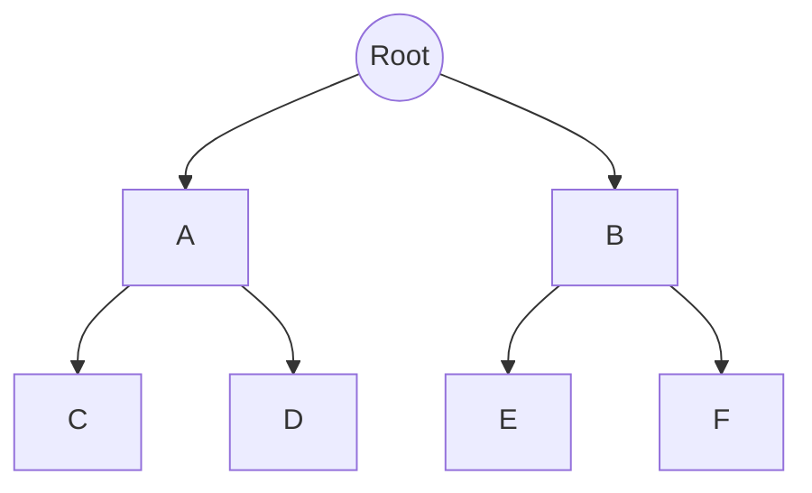
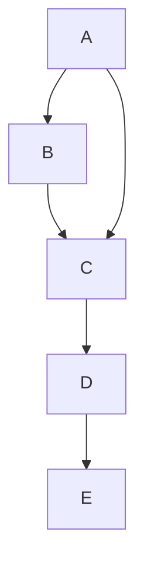

![[Okruhy#^9ec214]]

### Teorie grafů

Teorie grafů je oblast matematiky a informatiky, která studuje grafy, což jsou struktury sestávající z uzlů (vrcholů) a hran spojujících tyto uzly. Grafy mají široké uplatnění v různých oblastech, jako jsou počítačové sítě, dopravní systémy, sociální sítě a další.

#### Grafy

1. **Definice grafu**:
   - **Graf** $G = (V, E)$ se skládá z množiny vrcholů $V$ a množiny hran $E$, kde každá hrana spojuje dva vrcholy.
   - **Orientační graf**: Hrany mají směr.
   - **Neorientační graf**: Hrany nemají směr.

2. **Typy grafů**:
   - **Jednoduchý graf**: Graf bez smyček a vícenásobných hran.
   - **Multigraf**: Graf s vícenásobnými hranami.
   - **Pseudograf**: Graf s vícenásobnými hranami a smyčkami.
   - **Podgraf**: Graf, který je podmnožinou jiného grafu.
   - **Kompletní graf (Klika)**: Graf, ve kterém je každá dvojice vrcholů spojena hranou.

#### Vzdálenost v grafu

1. **Definice vzdálenosti**:
   - Vzdálenost mezi dvěma vrcholy $u$ a $v$ je délka nejkratší cesty mezi nimi, kde délka cesty je počet hran nebo součet vah hran na cestě.
   - **Nejkratší cesta**: Cesta s nejmenší délkou mezi dvěma vrcholy.

2. **Algoritmy pro hledání nejkratší cesty**:
   - **Dijkstra's Algorithm**: Pro grafy s ne zápornými vahami hran.
   - **Bellman-Ford Algorithm**: Pro grafy, které mohou mít záporné váhy hran.
   - **Floyd-Warshall Algorithm**: Pro nalezení nejkratších cest mezi všemi páry vrcholů.

#### Míry souvislosti

1. **Souvislost grafu**:
   - Graf je souvislý, pokud existuje cesta mezi každou dvojicí vrcholů.
   - **Silně souvislý graf**: Orientovaný graf, kde existuje orientovaná cesta mezi každou dvojicí vrcholů.

2. **Komponenty souvislosti**:
   - **Komponenta souvislosti**: Maximální souvislý podgraf.
   - **Algoritmus pro nalezení komponent souvislosti**: DFS (Depth-First Search) nebo BFS (Breadth-First Search).

#### Stromy a kostry

1. **Stromy**:
   - **Strom**: Acyklický souvislý graf.
   - **Kořenový strom**: Strom, ve kterém jeden uzel je určen jako kořen.

2. **Kostry grafu**:
   - **Kostra grafu (Spanning Tree)**: Podgraf, který je stromem a obsahuje všechny vrcholy původního grafu.
   - **Minimální kostra (Minimum Spanning Tree, MST)**: Kostra, jejíž součet vah hran je minimální.

3. **Algoritmy pro nalezení MST**:
   - **Kruskal's Algorithm**: Seřadí všechny hrany podle vah a postupně přidává nejmenší hrany, které nevytvářejí cyklus.
   - **Prim's Algorithm**: Začíná v libovolném vrcholu a postupně přidává nejlevnější hrany, které rozšiřují již nalezenou kostru.

#### Barvení grafů a jejich aplikace

1. **Barvení grafů**:
   - **Barvení vrcholů**: Přiřazení barev vrcholům grafu tak, aby žádné dva sousední vrcholy neměly stejnou barvu.
   - **Chromatické číslo**: Nejmenší počet barev potřebných k obarvení grafu.

2. **Aplikace**:
   - **Plánování**: Rozvrhy, kde barvy představují časové sloty.
   - **Mapy**: Barvení map, kde barvy představují různé regiony.

#### Toky v sítích

1. **Toka v sítích**:
   - **Síťový tok**: Množství "materiálu" proudícího z jednoho uzlu (zdroje) do jiného uzlu (cíle) v síti.
   - **Kapacita hrany**: Maximální množství toku, které může hrana přenést.

2. **Maximální tok**:
   - **Ford-Fulkerson Algorithm**: Iterativně hledá augmentující cesty a zvyšuje tok, dokud nelze najít další augmentující cestu.
   - **Edmonds-Karp Algorithm**: Implementace Ford-Fulkersonova algoritmu pomocí BFS pro hledání augmentujících cest.

**Příklad Ford-Fulkersonova algoritmu**:
1. Inicializace: Tok $f$ je 0 pro všechny hrany.
2. Hledání augmentující cesty pomocí DFS nebo BFS.
3. Aktualizace toku podél augmentující cesty.
4. Opakování kroků 2 a 3, dokud neexistuje žádná augmentující cesta.

**Příklad jednoduchého grafu**:

```mermaid
graph TD
    A -- B
    A -- C
    B -- C
    C -- D
    D -- E
```

**Příklad stromu**:



**Příklad orientovaného grafu**:



### Shrnutí

Teorie grafů poskytuje matematický rámec pro modelování a analýzu strukturovaných dat. Grafy, stromy, míry souvislosti, barvení grafů a toky v sítích jsou klíčové koncepty s širokým spektrem aplikací v reálném světě. Studium těchto konceptů je zásadní pro efektivní řešení problémů v různých oblastech vědy a techniky. Pokud máš další otázky nebo potřebuješ podrobnější vysvětlení, neváhej se zeptat!