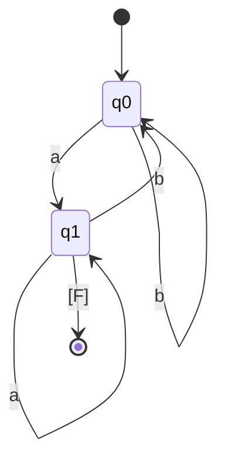
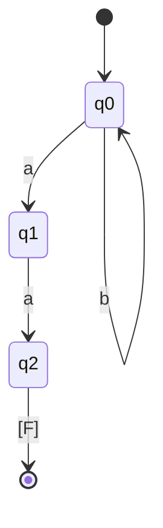
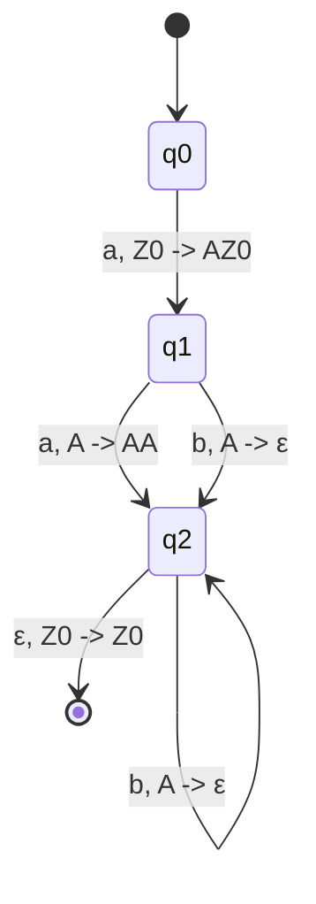

![[Okruhy#^de66ad]]

Teorie formálních jazyků a automatů je klíčovou oblastí informatiky, která se zabývá formálními prostředky pro popis a analýzu jazyků, automatů a gramatik.

#### Formální jazyky

**Formální jazyk** je množina řetězců (slov) nad pevně danou abecedou (množinou symbolů).

- **Abeceda ($\Sigma$)**: Konečná množina symbolů.
- **Slovo**: Konečná posloupnost symbolů z $\Sigma$.
- **Jazyk**: Množina slov nad abecedou $\Sigma$.

**Příklad**:
- $\Sigma = \{a, b\}$
- Slova: $ \lambda $ (prázdné slovo), $a$, $b$, $ab$, $ba$, $aa$, $bb$
- Jazyk $L = \{a, ab, baa\}$

#### Operace na jazycích

1. **Sjednocení ($L_1 \cup L_2$)**:
   - Množina slov, která jsou v $L_1$ nebo v $L_2$.
   $$
   L_1 \cup L_2 = \{w \mid w \in L_1 \text{ nebo } w \in L_2\}
   $$

2. **Průnik ($L_1 \cap L_2$)**:
   - Množina slov, která jsou v $L_1$ i v $L_2$.
   $$
   L_1 \cap L_2 = \{w \mid w \in L_1 \text{ a } w \in L_2\}
   $$

3. **Konkatenace ($L_1 L_2$)**:
   - Množina všech slov, která vzniknou zřetězením slova z $L_1$ a slova z $L_2$.
   $$
   L_1 L_2 = \{w_1 w_2 \mid w_1 \in L_1 \text{ a } w_2 \in L_2\}
   $$

4. **Kleeneho hvězda ($L^*$)**:
   - Množina všech slov, která vzniknou zřetězením libovolného počtu slov z $L$, včetně prázdného slova.
   $$
   L^* = \bigcup_{i=0}^{\infty} L^i
   $$

#### Formální prostředky pro popis jazyků

1. **Automaty**
   - **Konečné automaty (FA)**: Modelují regulární jazyky.
     - **Deterministické (DFA)**: Každý stav má přesně jednu přechodovou funkci pro každý symbol.
     - **Nedeterministické (NFA)**: Každý stav může mít více přechodových funkcí pro každý symbol, nebo žádnou.
   - **Zásobníkové automaty (PDA)**: Modelují bezkontextové jazyky. Mají zásobník jako paměť.
   - **Turingovy stroje (TM)**: Modelují rekurzivně spočetné jazyky. Jsou to obecné výpočetní modely s neomezenou pamětí.

2. **Gramatiky**
   - **Regulární gramatiky**: Generují regulární jazyky. Produkční pravidla mají tvar $A \rightarrow aB$ nebo $A \rightarrow a$.
   - **Bezkontextové gramatiky (CFG)**: Generují bezkontextové jazyky. Produkční pravidla mají tvar $A \rightarrow \alpha$, kde $A$ je neterminál a $\alpha$ je řetězec terminálů a neterminálů.
   - **Kontextové gramatiky**: Generují kontextové jazyky. Produkční pravidla mají tvar $\alpha A \beta \rightarrow \alpha \gamma \beta$, kde $A$ je neterminál a $\gamma$ je neprázdný řetězec terminálů a neterminálů.
   - **Neomezené gramatiky**: Generují rekurzivně spočetné jazyky. Produkční pravidla mají tvar $\alpha \rightarrow \beta$, kde $\alpha$ a $\beta$ jsou řetězce terminálů a neterminálů a $\alpha$ není prázdné.

3. **Regulární výrazy**
   - Popisují regulární jazyky pomocí kombinace symbolů a operátorů (sjednocení, konkatenace, Kleeneho hvězda).
   - **Příklad**: Regulární výraz $a(b|c)^*$ popisuje jazyk obsahující slova začínající na $a$, po kterém následuje libovolná posloupnost $b$ a $c$.

#### Konečné automaty

**Deterministické konečné automaty (DFA)**:
- Množina stavů $Q$
- Abeceda $\Sigma$
- Přechodová funkce $\delta: Q \times \Sigma \rightarrow Q$
- Počáteční stav $q_0 \in Q$
- Množina koncových stavů $F \subseteq Q$

**Nedeterministické konečné automaty (NFA)**:
- Množina stavů $Q$
- Abeceda $\Sigma$
- Přechodová funkce $\delta: Q \times \Sigma \rightarrow 2^Q$
- Počáteční stav $q_0 \in Q$
- Množina koncových stavů $F \subseteq Q$

#### Bezkontextové gramatiky (CFG)

**Bezkontextová gramatika** je čtveřice $(V, \Sigma, R, S)$:
- $V$ je množina neterminálů.
- $\Sigma$ je abeceda terminálů.
- $R$ je množina produkčních pravidel ve tvaru $A \rightarrow \alpha$, kde $A \in V$ a $\alpha \in (V \cup \Sigma)^*$.
- $S$ je startovní neterminál.

**Příklad CFG**:
- $V = \{S, A\}$
- $\Sigma = \{a, b\}$
- $R$:
  $$
  S \rightarrow aA \mid b \\
  A \rightarrow aS \mid bA \mid \varepsilon
  $$
- Startovní neterminál: $S$

#### Zásobníkové automaty (PDA)

**Zásobníkový automat** je model, který rozšiřuje konečný automat o zásobník:
- Množina stavů $Q$
- Abeceda vstupu $\Sigma$
- Abeceda zásobníku $\Gamma$
- Přechodová funkce $\delta: Q \times (\Sigma \cup \{\varepsilon\}) \times (\Gamma \cup \{\varepsilon\}) \rightarrow 2^{Q \times (\Gamma \cup \{\varepsilon\})}$
- Počáteční stav $q_0 \in Q$
- Počáteční symbol zásobníku $Z_0 \in \Gamma$
- Množina koncových stavů $F \subseteq Q$

**Příklad PDA**:

#### Chomského hierarchie

Chomského hierarchie klasifikuje formální jazyky do čtyř úrovní podle jejich generativní síly:

1. **Typ 0: Neomezené gramatiky**:
   - Generují rekurzivně spočetné jazyky.
   - Produkční pravidla mohou mít tvar $\alpha \rightarrow \beta$, kde \

(\alpha$ obsahuje alespoň jeden neterminál.

2. **Typ 1: Kontextové gramatiky**:
   - Generují kontextové jazyky.
   - Produkční pravidla mají tvar $\alpha A \beta \rightarrow \alpha \gamma \beta$, kde $\gamma$ je neprázdný řetězec.

3. **Typ 2: Bezkontextové gramatiky (CFG)**:
   - Generují bezkontextové jazyky.
   - Produkční pravidla mají tvar $A \rightarrow \alpha$, kde $A$ je neterminál a $\alpha$ je řetězec terminálů a neterminálů.

4. **Typ 3: Regulární gramatiky**:
   - Generují regulární jazyky.
   - Produkční pravidla mají tvar $A \rightarrow aB$ nebo $A \rightarrow a$, kde $A$ a $B$ jsou neterminály a $a$ je terminál.

### Shrnutí

Teorie formálních jazyků a automatů poskytuje základy pro pochopení struktury a vlastností jazyků a výpočetních modelů. Formální jazyky, automaty, gramatiky a regulární výrazy jsou klíčovými nástroji pro analýzu a návrh jazyků a systémů. Chomského hierarchie pak klasifikuje jazyky podle jejich složitosti a generativní síly. Pokud máš další otázky nebo potřebuješ podrobnější vysvětlení, neváhej se zeptat!